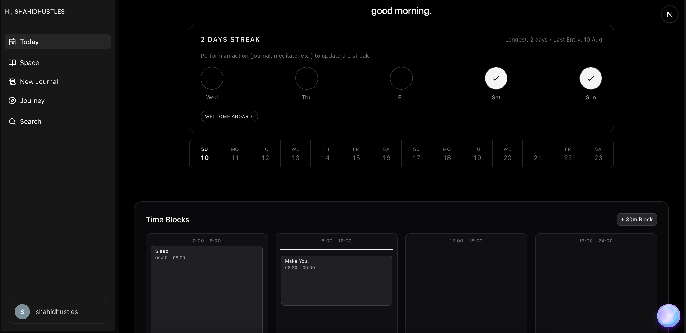

# You. - AI Mental Health Companion 🧠✨

**Transform your mental wellness journey with personalized AI-powered support.**

_You._ is a comprehensive mental health platform that combines cutting-edge AI voice therapy, mindful journaling, guided meditation, and breathing exercises to provide 24/7 accessible mental health support.



## 🌟 Features

### 🎤 **AI Voice Therapy**

- Natural conversational therapy sessions powered by Vapi AI
- 24/7 availability with empathetic AI responses
- Real-time emotional understanding and support
- Therapeutic techniques including CBT and mindfulness guidance

### 📝 **Intelligent Journaling**

- Rich text editor with BlockNote integration
- AI-generated prompts for meaningful self-reflection
- Auto-save functionality and draft management
- Progress tracking with word count analytics

### 🧘 **Mindfulness Suite**

- **Guided Meditation**: Customizable sessions (1-180 minutes) with ambient backgrounds
- **Breathing Exercises**: Interactive 4-7-8 breathing patterns with visual guides
- **Real-time Progress Tracking**: Monitor consistency and session duration

### 📊 **Journey Timeline**

- Interactive progress visualization
- Daily activity summaries and mood tracking
- Historical data insights with beautiful charts
- Milestone celebrations and streak tracking

### 🎯 **Personalized Onboarding**

- Comprehensive mental health assessment
- AI-powered personalized recommendations
- Custom focus area selection (stress reduction, sleep improvement, energy boost)
- Smart goal setting based on individual needs

## 🚀 Tech Stack

| Technology        | Purpose                                             |
| ----------------- | --------------------------------------------------- |
| **Next.js 15**    | Full-stack React framework with App Router          |
| **Vapi AI**       | Voice AI platform for natural therapy conversations |
| **Google Gemini** | Advanced AI model for understanding and support     |
| **Convex**        | Real-time database with TypeScript support          |
| **Clerk**         | Secure authentication and user management           |
| **BlockNote**     | Rich text editor for journaling                     |
| **Tailwind CSS**  | Modern styling with component variants              |
| **Motion**        | Smooth animations and micro-interactions            |
| **TypeScript**    | Type-safe development experience                    |

## 🛠️ Installation & Setup

### Prerequisites

- Node.js 18+
- npm/yarn/pnpm

### 1. Clone the Repository

```bash
git clone https://github.com/shahidhustles/You.git
cd You
```

### 2. Install Dependencies

```bash
npm install
# or
yarn install
```

### 3. Environment Variables

Create a `.env.local` file in the root directory:

```env
# Convex
CONVEX_DEPLOYMENT=your_convex_deployment_url
NEXT_PUBLIC_CONVEX_URL=your_convex_url

# Clerk Authentication
NEXT_PUBLIC_CLERK_PUBLISHABLE_KEY=your_clerk_publishable_key
CLERK_SECRET_KEY=your_clerk_secret_key
NEXT_PUBLIC_CLERK_SIGN_IN_URL=/sign-in
NEXT_PUBLIC_CLERK_SIGN_UP_URL=/sign-up

# Vapi AI
NEXT_PUBLIC_VAPI_PUBLIC_KEY=your_vapi_public_key
NEXT_PUBLIC_VAPI_ASSISTANT_ID=your_vapi_assistant_id

# AI Models (Optional - for custom AI features)
GOOGLE_GENERATIVE_AI_API_KEY=your_gemini_api_key
```

### 4. Setup Convex Database

```bash
npx convex dev
```

### 5. Run Development Server

```bash
npm run dev
```

Open [http://localhost:3000](http://localhost:3000) to view the application.

## 📁 Project Structure

```
├── app/                      # Next.js App Router
│   ├── (auth)/              # Authentication routes
│   ├── diary/               # Main diary application
│   │   ├── today/           # Daily dashboard
│   │   ├── journey/         # Progress timeline
│   │   ├── search/          # Content search
│   │   └── space/           # Meditation & breathing
│   ├── journal/             # Journaling interface
│   ├── onboarding/          # User onboarding flow
│   └── api/                 # API routes
├── components/              # Reusable UI components
│   ├── ui/                  # Base UI components (shadcn/ui)
│   ├── ai/                  # AI-related components
│   ├── diary/               # Diary-specific components
│   └── features/            # Feature sections
├── convex/                  # Convex backend functions
├── hooks/                   # Custom React hooks
├── lib/                     # Utility functions
└── public/                  # Static assets
```

## 🎨 Key Components

- **FloatingAIOrb**: Always-accessible voice therapy interface
- **TimelineVisualization**: Interactive progress tracking
- **JournalEditor**: Rich text journaling with AI prompts
- **MeditationTimer**: Customizable meditation sessions
- **BreathingGuide**: Visual breathing exercise patterns
- **OnboardingFlow**: Comprehensive user assessment

## 🚀 Deployment

### Vercel (Recommended)

1. Push your code to GitHub
2. Connect your repository to [Vercel](https://vercel.com)
3. Add environment variables in Vercel dashboard
4. Deploy automatically on every push

### Manual Build

```bash
npm run build
npm start
```

## 🔧 Development Scripts

```bash
npm run dev          # Start development server
npm run build        # Build for production
npm run start        # Start production server
npm run lint         # Run ESLint
```

## 🎯 Core User Journey

1. **Onboarding** → Complete mental health assessment
2. **Daily Check-in** → Track mood and set daily intentions
3. **AI Therapy** → Engage in voice conversations for support
4. **Journaling** → Reflect through guided prompts
5. **Mindfulness** → Practice meditation or breathing exercises
6. **Progress Review** → Visualize growth through timeline

## 🧪 Testing

The application includes comprehensive error handling and loading states. To test:

1. **Authentication Flow**: Sign up/sign in with Clerk
2. **AI Voice**: Test microphone permissions and voice interactions
3. **Data Persistence**: Verify journal entries and session logs save correctly
4. **Responsive Design**: Test across desktop, tablet, and mobile devices

## 🤝 Contributing

1. Fork the repository
2. Create a feature branch (`git checkout -b feature/amazing-feature`)
3. Commit your changes (`git commit -m 'Add amazing feature'`)
4. Push to the branch (`git push origin feature/amazing-feature`)
5. Open a Pull Request

## 📄 License

This project is licensed under the MIT License - see the [LICENSE](LICENSE) file for details.

## 🙏 Acknowledgments

- **Vapi AI** for voice therapy capabilities
- **Google** for Gemini AI model
- **Convex** for real-time database infrastructure
- **Clerk** for secure authentication
- **shadcn/ui** for beautiful UI components

## 📞 Support

For support, email [support@you-app.com] or join our Discord community.

---

**Built with ❤️ for mental health awareness and accessibility.**
